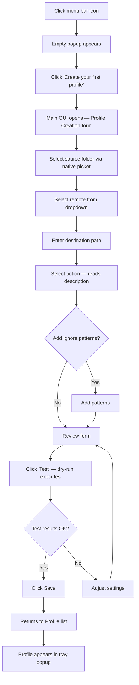
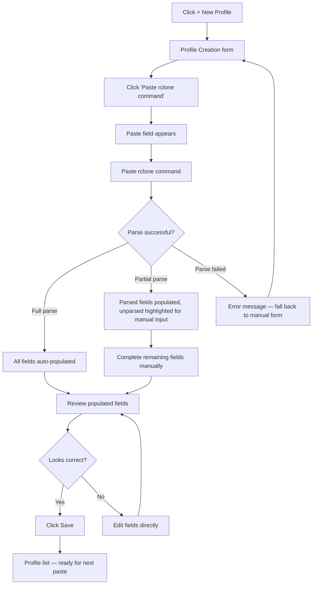
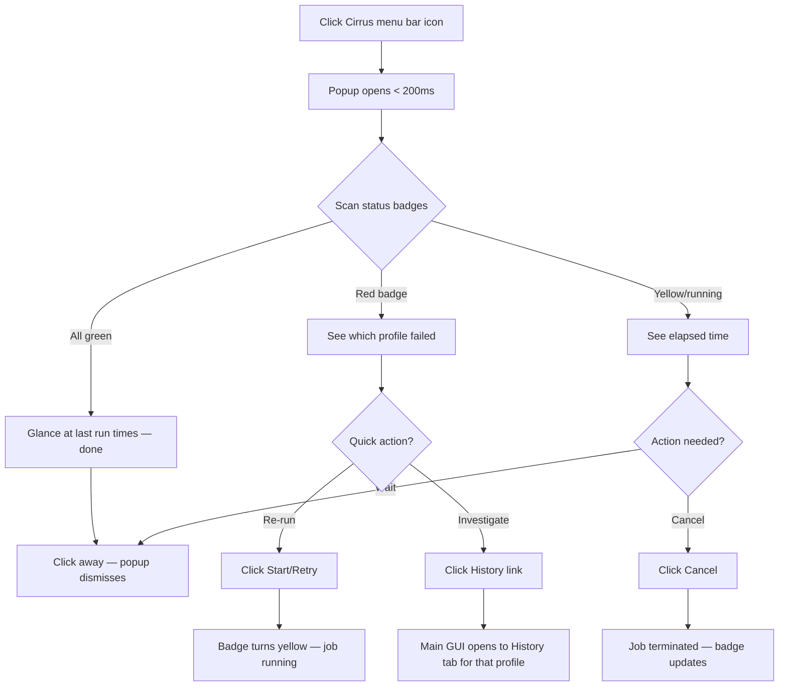
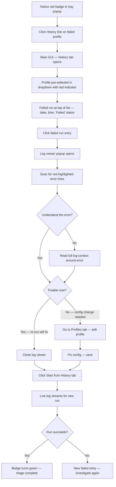
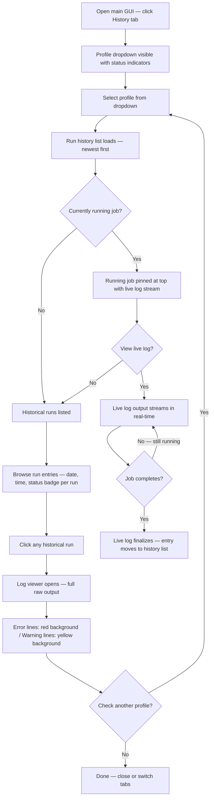
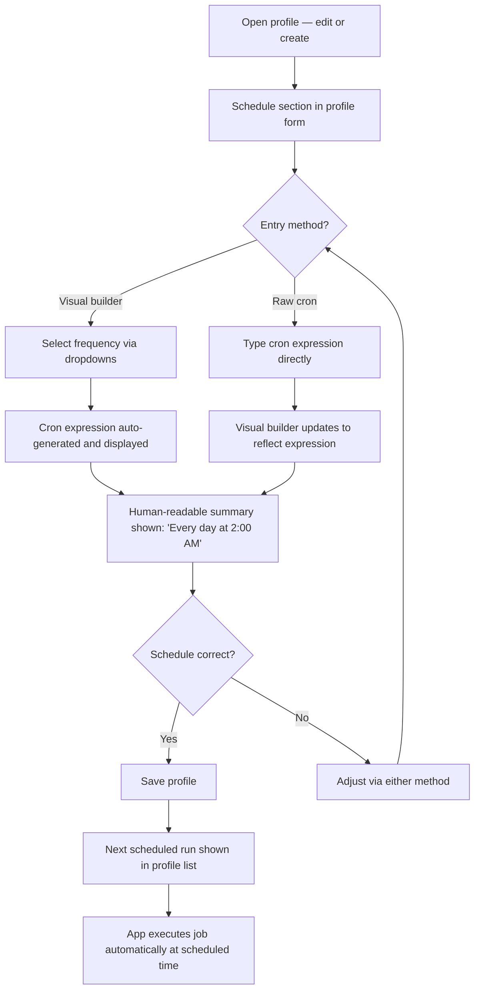

# UX Design Specification ai-slop

**Author:** Sane
**Date:** 2026-02-27

---

<!-- UX design content will be appended sequentially through collaborative workflow steps -->

## Executive Summary

### Project Vision

A native macOS menu bar application that replaces hand-written rclone shell scripts with a profile-based GUI. Two distinct UI surfaces: a tray popup for quick job execution and status monitoring, and a main GUI window for profile management, configuration, history, and settings. The app is a thin orchestration layer — rclone is the engine, the app provides the interface. Built with Swift + SwiftUI for full native macOS experience.

### Target Users

**First-Timer Fiona** — Non-technical users who follow tutorials to set up rclone. Need guided profile creation, clear action descriptions, confidence-building via dry-run/Test, and scheduling so they can "set it and forget it." Primary device: macOS desktop.

**Power User Pete** — Developers and technical users with many rclone remotes and existing shell scripts. Need fast migration via paste-to-create, raw cron expression input, and efficient bulk profile management. Value speed over guidance.

**Sysadmin Sam** — Reliability-focused users managing critical backup profiles. Need fast triage via status badges, per-profile history with syntax-highlighted logs, and the ability to re-run failed jobs immediately from the history tab.

### Key Design Challenges

1. **Two-surface coherence** — Tray popup (quick action) and main GUI (management) must feel like one cohesive app with natural flow between them. Tray links open the correct context in the main GUI.
2. **Beginner safety vs. power user speed** — Same screens must serve Fiona (guardrails, descriptions, guided flow) and Pete (paste-to-create, raw cron, minimal clicks) without cluttering either experience.
3. **Information density in constrained space** — Tray popup must display meaningful per-profile status for 1 to 50+ profiles in a small floating panel without becoming unusable.

### Design Opportunities

1. **Paste-to-create as signature interaction** — No other rclone GUI offers this. The paste → auto-populate → review → save flow is the app's "wow moment" for power users and tutorial-followers.
2. **History as operations center** — Per-profile history with live streaming, status-aware dropdown, and syntax-highlighted log viewer makes failure triage effortless.
3. **Tray popup as primary interface** — If done right, most users never need the main GUI for daily use. High-impact, low-friction.

## Core User Experience

### Defining Experience

The core interaction is the tray popup. Users click the menu bar icon, scan profile status badges, and either start a job (two clicks) or drill into history for triage. The tray popup is the daily-use surface — most users should rarely need the main GUI after initial setup. For scheduled users, the core action shifts from "start a job" to "verify jobs ran" — a single-click scan of green/red/yellow badges.

### Platform Strategy

- **Platform:** macOS native, Swift + SwiftUI
- **Input:** Mouse/keyboard (no touch considerations)
- **Menu bar presence:** Persistent NSStatusItem with custom SwiftUI popup (not native NSMenu) — transparent, rounded corners, modern macOS aesthetic
- **System integration:** Login Item for launch at startup, window close keeps app in tray, explicit Quit required to exit
- **Network dependency:** Jobs require network; block offline starts with clear messaging. rclone handles mid-job retries natively.
- **Future platforms:** Windows and Linux as fully native implementations (not cross-platform framework)

### Effortless Interactions

- **Starting a job:** Menu bar icon → popup → Start button. Two clicks, zero navigation.
- **Checking status:** Menu bar icon → popup shows all profiles with color-coded badges. One click, instant scan.
- **Triage flow:** Red badge in popup → click History → see failed run at top → click log → red-highlighted error lines → click Start to re-run. Linear, no backtracking.
- **Power user profile creation:** Paste rclone command → fields auto-populate → review → save. Under 30 seconds per profile.
- **Scheduling:** Set once, forget. Next day: "Last successful run: 2:00 AM" in the tray popup. Trust earned.

### Critical Success Moments

1. **First green checkmark** (Fiona) — Profile created, Test passes, first real run completes, green badge appears. Trust established.
2. **Paste-to-create "wow"** (Pete) — Shell command pasted, every field fills in automatically. Migration effort collapses from hours to minutes.
3. **Monday triage in under 2 minutes** (Sam) — Tray scan, drill into failures, re-run, all green. Reliability proven.
4. **First scheduled job "just works"** (all users) — Set a cron schedule, come back tomorrow, see it ran. The app earns "set and forget" trust.

### Experience Principles

1. **Tray-first design** — The tray popup is the primary interface. Design it as the daily-use surface; the main GUI is for setup and deep investigation only.
2. **Two clicks to action** — Starting a job, checking status, or triaging a failure should never require more than two intentional clicks from the menu bar icon.
3. **Show, don't explain** — Status badges, live logs, and color-coded history convey state instantly. Minimize text-based status in favor of visual indicators.
4. **Earn trust progressively** — Guide new users through Test (dry-run) → first manual run → scheduled runs. Each step builds confidence before the next.

## Desired Emotional Response

### Primary Emotional Goals

**Quiet confidence** — Users should feel their file syncs are handled reliably, visibly, without anxiety. The app's emotional signature is competence without complexity. Users trust it because it shows them everything, not because it hides complexity behind reassuring messages.

### Emotional Journey Mapping

| Moment | Desired Feeling | What Drives It |
|---|---|---|
| First open (empty state) | Welcomed, not overwhelmed | Friendly CTA, no blank screen |
| Profile creation | Guided confidence | Action descriptions, Test button, clear form |
| Paste-to-create | Impressed, "this gets me" | Instant auto-populate from familiar syntax |
| First successful run | Relief + accomplishment | Green checkmark, visible proof it worked |
| Checking tray popup | Calm, in control | All badges green at a glance |
| Seeing a red badge | Alert but not panicked | Clear failure indicator, obvious next step |
| Triage and re-run | Competent, efficient | Linear flow to resolution |
| Returning daily | Invisible — it just works | Nothing demands attention unless something failed |

### Micro-Emotions

- **Confidence over confusion** — The most critical axis. Every interaction should reinforce "I know what's happening." Clear labels, visible state, no ambiguous UI.
- **Trust over skepticism** — Earned through visibility: logs, badges, dry-runs. Never ask users to take the app's word for it — show proof.
- **Accomplishment over frustration** — Profile creation ends with a green checkmark, not a wall of settings. Triage ends with all-green, not lingering uncertainty.

### Design Implications

- **Confidence** → Always show current state (badges, elapsed time, last run). Never leave the user guessing what the app is doing.
- **Trust** → Test/dry-run as first-class workflow. Complete log capture with no silent failures. Error lines visually distinct in log viewer.
- **Calm** → The tray popup should feel like a quiet dashboard, not an alert center. Green is the default state. Red demands attention only when warranted.
- **Efficiency** → Linear triage flows with no backtracking. Two clicks to start a job. History opens in context, not from scratch.

### Emotional Design Principles

1. **Visibility builds trust** — Show state, show logs, show proof. The app earns trust by being transparent, not by promising reliability.
2. **Silence means success** — When everything is working, the app should be invisible. Demand attention only when something needs it.
3. **Errors are navigable, not alarming** — A red badge is an entry point to a resolution flow, not a panic signal. Guide users from problem to fix.
4. **Reward completion, don't gatekeep** — First green checkmark, first scheduled run, paste-to-create auto-fill — these are moments of delight. Make them feel good.

## UX Pattern Analysis & Inspiration

### App Identity

**Name:** Cirrus — a thin, high-altitude cloud. Evokes cloud storage without being literal. The word feels light and fast, matching the tray-first, low-friction design philosophy.

### Inspiring Products Analysis

**QuillBot (menu bar dropdown)**
- Clean, compact popup anchored to the tray icon — no window chrome, just content
- Focused on one action surface — immediate visibility of what you need
- Lightweight feel — opens fast, doesn't feel like launching an app
- Directly informs Cirrus's tray popup: floating panel, not a window

**1Password (two-surface architecture)**
- Quick-access popup for daily use (search, autofill, copy) AND full app for management (organizing, editing, creating)
- Clean visual hierarchy — items are scannable with icons, labels, and subtle metadata
- Same architectural pattern as Cirrus: popup for daily action, full GUI for management

**LM Studio (desktop app)**
- Modern interface with clear visual sections and sidebar navigation
- Status indicators for model state (downloaded, running) — maps to profile status badges
- Handles complex technical content without overwhelming the user

### Transferable UX Patterns

**Navigation:**
- 1Password's two-surface split — popup for action, full app for management. Cirrus follows this pattern exactly.
- LM Studio's sidebar for context switching — informs main GUI navigation between profile list and history tab.

**Interaction:**
- QuillBot's lightweight popup feel — Cirrus's tray popup should feel equally fast and ephemeral. A floating panel, not a window.
- 1Password's scannable list items — profile rows need icon/badge + name + metadata, all scannable at a glance.

**Visual:**
- LM Studio's colored status indicators — translate directly to Cirrus's profile status badges (green/red/yellow).
- 1Password's clean grouping and spacing — profiles need clear visual separation without heavy dividers.

### Anti-Patterns to Avoid

- **rclone's web GUI** — Server-management focused, overwhelming settings panels, no concept of quick action. The opposite of tray-first design.
- **Overloaded popups** — Menu bar apps that cram a full app into the popup. Cirrus's popup does three things: show status, start/cancel, link to history. Management belongs in the main GUI.
- **Settings-first onboarding** — Apps that dump users into configuration on first launch. Cirrus's empty state is a single friendly CTA, not a setup wizard.
- **Generic sync tool aesthetics** — Bland progress bars and file trees. Cirrus should feel like a native macOS utility, not a cross-platform file manager.

### Design Inspiration Strategy

**Adopt:**
- QuillBot's floating panel popup — lightweight, fast, no window chrome
- 1Password's two-surface architecture — popup for daily use, full app for management
- LM Studio's status badge pattern — colored indicators for state at a glance

**Adapt:**
- 1Password's scannable list density — adapt for profile rows showing name + status badge + last run + action button
- LM Studio's sidebar navigation — adapt for switching between Profiles and History tabs in the main GUI

**Avoid:**
- Full-app-in-a-popup pattern — keep the popup focused on status and action
- Configuration wizard onboarding — one CTA, not a multi-step setup
- Cross-platform visual compromise — stay fully native macOS with SwiftUI

## Design System Foundation

### Design System Choice

**SwiftUI Native + Apple Human Interface Guidelines (HIG)** — Use SwiftUI's built-in component library and macOS design conventions as the foundation. No third-party UI frameworks.

### Rationale for Selection

- **Native feel is a success criterion** — "The app feels native, not like a wrapper" is an explicit project goal. SwiftUI's defaults achieve this automatically.
- **Solo developer efficiency** — SwiftUI provides production-quality components (buttons, dropdowns, text fields, toggles, lists) with no additional dependencies.
- **Free platform integration** — Dark mode, VoiceOver accessibility, system fonts (SF Pro), system colors, system spacing, native animations — all built in.
- **No web frameworks apply** — Material Design, Ant Design, Tailwind, etc. are web/cross-platform. Cirrus is pure native SwiftUI.
- **Maintenance simplicity** — No third-party UI library to update or maintain. SwiftUI components evolve with macOS.

### Implementation Approach

- Use standard SwiftUI controls for all form elements (profile creation, settings, scheduling)
- Use `NSStatusItem` for menu bar presence
- Custom borderless `NSWindow` with SwiftUI content for the tray popup (not `NSPopover`) — enables the QuillBot-style floating panel aesthetic with transparency and rounded corners
- SwiftUI `NavigationSplitView` or tab-based layout for the main GUI window
- System SF Symbols for all iconography — consistent with macOS and available in multiple weights

### Customization Strategy

**Custom components needed beyond SwiftUI defaults:**

1. **Tray popup panel** — Borderless window with SwiftUI content, custom shadow, rounded corners, transparency. Dismisses on click-outside or focus loss.
2. **Status badge** — Small colored circle (green/red/yellow) paired with an SF Symbol shape (checkmark/xmark/clock) for color-blind accessibility. Reusable across tray popup, profile list, and history dropdown.
3. **Profile row** — Compact component showing name + status badge + metadata (last run or elapsed time) + action button (Start/Cancel). Used in both tray popup and main GUI profile list for visual consistency.
4. **Log viewer** — Scrollable text view with per-line background coloring: red for error lines, yellow for warning lines, default for normal output. Monospace font. Used for both historical log viewing and live streaming.
5. **Cron builder** — Visual UI for constructing cron expressions with dropdowns/toggles for minute, hour, day-of-month, month, day-of-week. Paired with a raw text input that stays in sync.

## Defining Experience

### Core Interaction

**"Click the cloud, see your world, act in two clicks."** — The tray popup is the defining experience. Users click the Cirrus menu bar icon, scan profile status badges instantly, and take action (start, cancel, or investigate) without navigating away from what they're doing. The popup is the product. The main GUI is the back office.

### User Mental Model

**Current approach (what Cirrus replaces):**
1. Remember which script to run (or reconstruct the rclone command)
2. Open terminal
3. Execute, wait, read output, hope it worked
4. Repeat next time they remember

**Cirrus mental model:** Click icon → see everything → tap Start. The shift is from "run a command" to "check a dashboard." File sync becomes a glanceable status, not a manual task.

**Confusion risks:**
- **Action semantics** — rclone `sync` deletes destination files that don't exist at source. Users with a "backup" mental model may not expect deletion. Action descriptions during profile creation are the primary mitigation.
- **Paste-to-create partial parsing** — Complex rclone commands may only partially parse. The fallback to manual entry must feel like helpful pre-filling, not a broken parser. Pre-fill what was understood, highlight what needs manual input.

### Success Criteria

- User can scan all profile statuses in under 2 seconds after opening the popup
- Starting a job requires exactly two clicks from menu bar icon (click icon → click Start)
- A red badge immediately communicates "something needs attention" without reading text
- User never needs to open the main GUI for daily start/check/triage workflows
- Paste-to-create correctly parses source, destination, action, and common exclude patterns from standard rclone commands

### Pattern Analysis

**Entirely established patterns in combination** — no novel interaction design required:
- Menu bar popup → QuillBot, 1Password
- Status badges → monitoring dashboards, CI/CD tools
- Start/Stop controls → Time Machine, task runners
- Scannable list with metadata → 1Password vault, Finder sidebar

The innovation is curation, not invention — putting exactly the right information density into the popup so users almost never need the full GUI.

### Experience Mechanics

**Tray Popup Flow (the defining interaction):**

| Step | User Action | System Response | Feedback |
|---|---|---|---|
| 1. Initiation | Clicks Cirrus menu bar icon | Popup appears (< 200ms) | All profiles visible with badges |
| 2. Orientation | Scans badges | — | Green = good, Red = failed, Yellow = running/warning |
| 3a. Start job | Clicks Start on idle profile | rclone process spawns, badge turns yellow | Elapsed timer begins, live status in popup |
| 3b. Cancel job | Clicks Cancel on running profile | rclone process terminated | Badge updates, log captured |
| 3c. Investigate | Clicks History link | Main GUI opens to history tab for that profile | Failed run at top, log viewer available |
| 4. Completion | Clicks away or presses Escape | Popup dismisses | Job continues in background silently |

**Empty State Flow (first launch):**

| Step | User Action | System Response | Feedback |
|---|---|---|---|
| 1. First click | Clicks Cirrus menu bar icon | Popup appears with empty state | "Create your first profile" button |
| 2. Onboard | Clicks CTA button | Main GUI opens to profile creation form | Guided form with action descriptions |
| 3. First profile | Completes form, clicks Save | Profile appears in popup | Ready to Start |

## Visual Design Foundation

### Color System

**Brand Accent:** Sky blue (#4A9EDB) — cloud-associated, trustworthy. Used for primary buttons, selected states, and active indicators. Adapts luminance for light/dark modes.

**Menu Bar Icon:** Grayscale template image — cloud outline or cirrus wisp. Uses `NSImage.isTemplate = true` so macOS renders it correctly in both light and dark menu bars. No color tint.

**Status Colors (semantic, universal meaning):**
- Green (`systemGreen`) — success, last run completed
- Red (`systemRed`) — failure, needs attention
- Yellow/Amber (`systemYellow`) — running, in progress, or warning

**Surface & Text Colors:** All system semantic colors — `primaryLabel`, `secondaryLabel`, `windowBackground`, `separatorColor`, etc. Zero custom grays. macOS handles all light/dark transitions natively.

**Log Viewer Highlights:** Low-opacity background tints — red for error lines, yellow for warning lines. Text remains readable in both light and dark modes.

### Theme Support

Three modes available in settings:
- **Light** — forces light appearance
- **Dark** — forces dark appearance
- **System** — follows macOS system appearance (default)

Implementation: SwiftUI `preferredColorScheme` on the app's window group. All semantic colors, the sky blue accent, and status colors adapt automatically across all three modes.

### Typography System

**Primary:** SF Pro (macOS system font) — SwiftUI default. No custom fonts.

**Monospace:** SF Mono — used in the log viewer and cron expression raw input. Native, designed for code/log readability.

**Type Scale:** SwiftUI built-in text styles:
- `.title` — screen headers (e.g., "Profiles," "History")
- `.headline` — profile names, section labels
- `.body` — descriptions, form labels, metadata
- `.caption` — timestamps, secondary metadata (last run time, elapsed)
- `.system(.body, design: .monospaced)` — log output, cron expressions

### Spacing & Layout Foundation

**Base unit:** 4pt (SwiftUI default). Multiples: 4, 8, 12, 16, 24.

**Tray popup (information-dense):**
- ~8pt vertical padding between profile rows
- Show 5-7 profiles without scrolling on a typical display
- Scrollable for larger profile counts
- Fixed width (~320pt), dynamic height based on profile count up to a max

**Main GUI (spacious):**
- Standard macOS window spacing (12-16pt between sections)
- Tab or sidebar navigation with generous content area
- Minimum window size to prevent layout collapse
- Resizable for user preference

### Accessibility Considerations

- **Contrast:** System semantic colors meet WCAG AA contrast ratios by default in all three theme modes
- **Color independence:** Status badges use color + SF Symbol shape (checkmark/xmark/clock) — never color-only
- **VoiceOver:** Built into SwiftUI components. Custom views annotated with `.accessibilityLabel` and `.accessibilityValue`
- **Click targets:** Minimum 24x24pt for all interactive elements (macOS HIG standard)
- **Motion:** Respect `accessibilityReduceMotion` for any animated transitions

## Design Direction

### Directions Explored

Three layout directions evaluated via ASCII wireframes:
- **Direction A (Compact List):** Dense profile rows, sidebar navigation. Maximum profiles visible (~7 before scroll). Utilitarian.
- **Direction B (Card Rows):** Spacious rows with source→destination visible in popup, sidebar navigation. ~3-4 profiles before scroll.
- **Direction C (Hybrid):** Compact popup, spacious GUI with tab navigation.

### Chosen Direction

**Custom combination: Spacious popup + tabs + detail separation.**

**Tray Popup — spacious, status-focused:**
- Each profile row: name (`.headline`) + status badge + metadata line (last run time or elapsed) + action button (Start/Cancel/Retry)
- No source→destination in the popup — keep it focused on status and action
- Generous vertical padding per row (~16pt between profiles)
- 3-4 profiles visible before scrolling
- Light separator between profiles
- Fixed width (~320pt), scrollable for larger profile counts
- Footer: "Open Cirrus..." link to launch main GUI
- Header: Cirrus wordmark + settings gear + window control

**Main GUI — spacious, tab-navigated:**
- Top tab bar: Profiles | History | Settings
- Profile rows show full detail: name, source → destination, last run status/time, next scheduled run, action button
- Generous spacing between profile cards (~16-24pt)
- [+ New Profile] button at bottom of profile list
- History tab: profile dropdown with status indicators, run history list, log viewer
- Settings tab: rclone path, rclone version, config location, theme selection

### Design Rationale

- **Spacious popup rows** — Each profile deserves visual weight. Users scan 3-4 profiles comfortably. For users with many profiles, scrolling is acceptable since the popup is for quick action, not inventory management.
- **No source→dest in popup** — The popup answers "what's the status?" and "what can I do?" not "what are the details?" Detail belongs in the main GUI where there's room.
- **Tabs over sidebar** — For three navigation items (Profiles, History, Settings), a sidebar is overkill and wastes horizontal space. Tabs are more conventional for this count and keep the full window width available for content.
- **Spacious main GUI** — The main GUI is for management tasks (creating profiles, reviewing history, reading logs). Generous spacing reduces cognitive load during configuration and triage.

### Implementation Notes

- Tray popup: Borderless `NSWindow` with `NSVisualEffectView` for vibrancy/translucency, SwiftUI content via `NSHostingView`
- Main GUI: Standard `NSWindow` with SwiftUI `TabView` for navigation
- Profile row component shared between popup and main GUI but with different detail levels — popup variant omits source→destination and schedule info
- Scrollable popup uses SwiftUI `ScrollView` with `.frame(maxHeight:)` to cap the popup height

## User Journey Flows

### Flow 1: First Profile Creation

Entry: Empty tray popup → "Create your first profile" CTA



### Flow 2: Paste-to-Create Migration

Entry: Profile creation form → "Paste rclone command" toggle



### Flow 3: Daily Tray Interaction

Entry: Click Cirrus menu bar icon



### Flow 4: Failure Triage

Entry: Red badge in tray popup → History link



### Flow 5: History & Log Viewing

Entry: Main GUI → History tab



### Flow 6: Schedule Setup

Entry: Profile creation or edit form → Schedule section



### Journey Patterns

**Navigation patterns:**
- Tray popup History link opens main GUI to the correct profile in History tab (context-aware deep linking)
- Profile creation/edit always returns to Profile list on save
- Log viewer is a popup/sheet over the History tab, not a separate navigation level

**Feedback patterns:**
- Status badges update within 1 second of state change
- Running jobs always show elapsed time (in both tray popup and History tab)
- Every action has immediate visual confirmation (badge color change, timer start, list update)

**Error recovery patterns:**
- Parse failures fall back gracefully — partial parse pre-fills what it can, highlights remaining fields for manual input
- Failed jobs always have a clear path: view log → understand → fix → re-run
- Destructive actions (delete profile, cancel job, quit app) always require confirmation dialog

### Flow Optimization Principles

1. **Minimize clicks to value** — Two clicks from menu bar icon to job running. One click to scan all status. Three clicks from red badge to re-running a failed job.
2. **Context-aware navigation** — Clicking History on a specific profile opens the History tab with that profile pre-selected. No extra selection step.
3. **Progressive disclosure** — Tray popup shows status only. Main GUI adds source→destination and schedule detail. Log viewer adds full raw output. Each level adds depth without cluttering the previous level.
4. **Non-destructive defaults** — Test/dry-run before first real run. Confirmation on all destructive actions. Config snapshot protects running jobs from mid-flight edits.

## Component Strategy

### Design System Components (SwiftUI Native)

**Standard controls — no custom work required:**
- Buttons (`Button`, `BorderlessButtonStyle`) — form actions, Start/Cancel/Retry
- Text fields (`TextField`, `SecureField`) — path inputs, cron expression, search
- Dropdowns/Pickers (`Picker`) — remote selection, action selection, profile dropdown in History
- Toggles (`Toggle`) — settings switches
- Forms (`Form`) — profile creation/edit layout
- Tab navigation (`TabView`) — Profiles | History | Settings
- Lists (`List`, `ScrollView`) — profile lists, history run lists
- Native folder picker (`NSOpenPanel`) — source folder selection
- System confirmation dialogs (`Alert`, `confirmationDialog`) — destructive action confirmations
- SF Symbols — all iconography (checkmark, xmark, clock, play, stop, gear, folder, etc.)

### Custom Components

#### 1. Status Badge

**Purpose:** Communicate profile state at a glance across all surfaces
**Anatomy:** Colored circle + SF Symbol shape
**States:**
| State | Color | Symbol | VoiceOver |
|---|---|---|---|
| Idle/Success | Green (`systemGreen`) | checkmark.circle.fill | "Status: successful" |
| Failed | Red (`systemRed`) | xmark.circle.fill | "Status: failed" |
| Running | Yellow (`systemYellow`) | clock.circle.fill | "Status: running" |
| Never Run | Gray (`systemGray`) | circle | "Status: not yet run" |

**Size variants:** Small (12pt — popup rows, dropdown inline) and Medium (16pt — GUI profile list)
**Accessibility:** Color + shape ensures color-blind usability. VoiceOver announces state as text.

#### 2. Profile Row — Popup Variant

**Purpose:** Scannable profile summary for tray popup — status-focused, no detail
**Anatomy:**
```
[StatusBadge] Profile Name                    [▶ Start]
             Last run: Today 2:00 AM
```
**Content:** Status badge | Name (`.headline`) | Metadata (`.caption` — last run time or elapsed time) | Action button | History icon
**States:** Idle (Start button), Running (Cancel button + elapsed time), Failed (Retry button), Never Run (Start button, no metadata)
**Interaction:** Action button starts/cancels job. History icon deep-links to History tab with profile pre-selected.
**Spacing:** ~16pt vertical padding between rows. Light separator line.

#### 3. Profile Row — GUI Variant

**Purpose:** Detailed profile card for main GUI Profiles tab
**Anatomy:**
```
Profile Name                              [StatusBadge]
~/Documents → gdrive:Backups/
Last: Today 2:00 AM  Next: Tomorrow 2:00 AM
                                          [▶ Start]
```
**Content:** Name (`.headline`) | Status badge | Source → Destination (`.body`) | Last run status/time + Next scheduled run (`.caption`) | Action button
**States:** Same as popup variant with additional detail lines
**Interaction:** Click row body to open profile editor. Action button starts/cancels. Does not navigate away.
**Spacing:** ~16-24pt vertical padding between cards.

#### 4. Log Viewer

**Purpose:** Display rclone output with syntax highlighting for error/warning visibility
**Content:** Raw stdout/stderr text in SF Mono
**Presentation:** Sheet or popup overlay on History tab — not a separate navigation level
**States:**
- **Static** — Historical log. Full content loaded. Scrollable.
- **Streaming** — Live job output. Auto-scrolls to bottom. Manual scroll overrides auto-scroll; resumes on scroll-to-bottom.

**Highlighting rules:**
- Lines containing `ERROR` or `Failed` → red background tint (low opacity, text remains readable)
- Lines containing `WARN` or `WARNING` → yellow background tint
- All other lines → default background

**Interaction:** Scroll, select text, copy text. Close via sheet dismiss or Escape.
**Accessibility:** Monospace font at `.body` size minimum. Background tints use sufficient contrast in both light and dark modes.

#### 5. Cron Builder

**Purpose:** Visual schedule configuration with dual-entry (visual builder + raw expression)
**Anatomy:**
```
Schedule: [Visual Builder ▾]  [Raw: 0 2 * * *]
          "Every day at 2:00 AM"
```
**Content:**
- Visual dropdowns: Minute | Hour | Day of Month | Month | Day of Week
- Raw text input: editable cron expression
- Human-readable summary label (auto-generated)

**States:** Visual and raw always in sync. Editing one updates the other. Summary always reflects current expression.
**Validation:** Invalid cron expressions show inline error. Visual builder prevents invalid combinations.
**Interaction:** Users choose preferred entry method. Both produce identical results.

#### 6. Tray Popup Panel

**Purpose:** The primary Cirrus interface — floating panel anchored to menu bar icon
**Anatomy:**
```
┌───────────────────────────────────┐
│  ☁ Cirrus              ⚙   □    │  ← Header
├───────────────────────────────────┤
│  [Profile Row - Popup Variant]    │  ← Scrollable
│  [Profile Row - Popup Variant]    │     profile
│  [Profile Row - Popup Variant]    │     list
├───────────────────────────────────┤
│         Open Cirrus...            │  ← Footer
└───────────────────────────────────┘
```
**States:**
- **Empty** — "Create your first profile" CTA button (onboarding)
- **Populated** — 3-4 profiles visible before scroll
- **Scrollable** — `ScrollView` with `.frame(maxHeight:)` cap

**Implementation:** Borderless `NSWindow` + `NSVisualEffectView` (vibrancy/translucency) + `NSHostingView` for SwiftUI content
**Dimensions:** Fixed width ~320pt. Dynamic height based on profile count, capped at ~400pt max.
**Interaction:** Appears on menu bar icon click (< 200ms). Dismisses on click-outside, Escape, or window focus loss.

#### 7. History Run Entry

**Purpose:** Single row in per-profile run history list
**Anatomy:**
```
[StatusBadge] Saturday, Feb 27  2:00 AM    Duration: 3m 42s    Successful
```
**Content:** Status badge | Date/time (`.body`) | Duration (`.caption`) | Status label
**States:**
- **Historical** — Clickable. Opens log viewer on click.
- **Running (pinned)** — Pinned at top of list with live indicator. Click opens live streaming log viewer.

**Interaction:** Click anywhere on the row to open log viewer for that run.
**Sorting:** Newest first. Running entry always pinned at top regardless of sort.

### Component Implementation Strategy

**Build order aligned with user journey criticality:**

**Phase 1 — Core (blocks all journeys):**
1. Tray Popup Panel — the defining experience surface
2. Status Badge — used in every other component
3. Profile Row (Popup Variant) — tray popup content
4. Profile Row (GUI Variant) — main GUI Profiles tab content

**Phase 2 — Execution & History (blocks Flows 3-5):**
5. Log Viewer — needed for history, triage, and live streaming
6. History Run Entry — needed for history browsing

**Phase 3 — Configuration (blocks Flows 1, 2, 6):**
7. Cron Builder — needed for schedule setup (profile creation uses standard SwiftUI Form controls)

## UX Consistency Patterns

### Button Hierarchy

**Primary Actions** — Filled/prominent style (`borderedProminent`). One primary per context.
- Tray popup: "Start" per profile row (SF Symbol `play.fill`)
- Profile form: "Save Profile" / "Create Profile"
- Log viewer: "Close"

**Secondary Actions** — Bordered style (`bordered`). Supporting actions.
- "Cancel" (running job — SF Symbol `stop.fill`, red tint)
- "Edit" profile
- "Test" (dry-run) during profile creation

**Destructive Actions** — Red-tinted text button, always requires confirmation.
- "Delete Profile" — confirmation alert: "Delete [profile name]? This cannot be undone." with "Delete" (red) / "Cancel" buttons
- Never placed next to primary actions without visual separation

**Tertiary/Link Actions** — Plain text buttons or navigation links.
- "View History" link from tray popup row
- "Open Cirrus" in tray popup footer
- Tab switches (Profiles | History | Settings)

**Icon-Only Buttons** — Used in compact contexts (tray popup profile rows). Always paired with tooltip on hover.

### Feedback Patterns

**Status Badge System** (consistent across tray popup, profile list, history dropdown):

| State | Color | SF Symbol | Label |
|-------|-------|-----------|-------|
| Success | `Color.green` | `checkmark.circle.fill` | "Last run successful" |
| Failed | `Color.red` | `xmark.circle.fill` | "Last run failed" |
| Running | `Color.yellow` | `clock.arrow.2.circlepath` | "Running..." |
| Never Run | `Color.secondary` | `circle` | "Not yet run" |
| Scheduled | `Color.blue` | `calendar.circle` | "Scheduled" |

**Inline Feedback** — Transient messages shown contextually:
- Profile saved: Brief checkmark animation, return to profile list
- Job started: Status badge transitions to Running, elapsed timer appears
- Job completed: Badge transitions with brief highlight animation (green flash for success, red for failure)
- No toast notifications or banners — status badges ARE the feedback

**Error Messages** — Shown inline, not in alerts (except destructive confirmations):
- Form validation: Red text below the invalid field, field border turns red
- rclone errors: Displayed in the log viewer, badge turns red, tray icon gets dot indicator
- Connection issues: Inline message with "Retry" action

### Form Patterns

**Profile Creation/Edit Form Layout:**
- Vertical stack, one field per row, spacious padding (~16pt between fields)
- Labels above fields (not inline), using `.secondary` text color
- Required fields: Name, Source, Destination, Action — no asterisk, all fields are contextually obvious
- Optional sections: Ignore Patterns, Extra Flags — collapsible disclosure groups

**Field Types:**
- **Text fields**: Standard `TextField` with placeholder text. Rounded border style.
- **Folder picker (Source)**: Text field + "Browse..." button → native `NSOpenPanel`
- **Remote selector (Destination)**: Dropdown of discovered remotes + text field for path
- **Action selector**: Segmented `Picker` (Sync | Copy | Move | Delete) with one-line description beneath the selected action
- **Ignore patterns**: Multi-line `TextEditor` with monospace font, one pattern per line
- **Extra flags**: Text field, monospace font, placeholder `--dry-run --verbose`

**Validation Timing:**
- On submit (not on keystroke) — don't interrupt the user while typing
- Required fields validated on "Save" — highlight all missing fields at once
- Source path validated on blur (check if directory exists)

**Paste-to-Create Flow:**
- "Paste rclone command" button at top of creation form
- Parses command → pre-fills matching form fields
- Shows what was parsed with brief highlight on populated fields
- User reviews and completes any missing fields before saving

### Navigation Patterns

**Tray Popup → Main GUI Transitions:**
- "Open Cirrus" link in tray popup footer opens main window, brings to front
- "View History" on a profile row opens main window, switches to History tab, selects that profile in dropdown
- Clicking tray icon while main window is open: shows tray popup (not toggle focus to window)

**Main GUI Tab Navigation:**
- `TabView` with 3 tabs: Profiles | History | Settings
- Tab state persists while window is open
- Default tab on first open: Profiles
- Deep-link from tray history action: History tab with profile pre-selected

**Back/Forward Within Tabs:**
- Profile list → Profile detail/edit → back to list (NavigationStack)
- History list → Log viewer popup → dismiss popup, return to history
- No nested navigation deeper than 2 levels

**Window Behavior:**
- Close window (⌘W): Window closes, app remains in tray — no confirmation needed
- Quit app (⌘Q / tray menu "Quit"): If scheduled jobs exist, show warning alert: "Scheduled jobs will stop running if you quit Cirrus." with "Quit Anyway" / "Cancel"
- Reopen: ⌘-click tray icon or "Open Cirrus" from tray popup

### Modal & Overlay Patterns

**Confirmation Alerts** (native `alert` modifier) — Used sparingly:
- Delete profile
- Quit with active schedules
- Never for starting/cancelling jobs (those are direct actions)

**Log Viewer** — Sheet presentation (`.sheet` modifier):
- Opens over the History tab as a modal sheet
- Full log content with syntax highlighting
- Single "Close" button or swipe to dismiss
- Scrollable, monospace font (SF Mono)

**Tray Popup Panel** — Custom `NSWindow`:
- Appears below menu bar icon, anchored to icon position
- Dismisses on: click outside, Escape key, clicking tray icon again
- No drag/resize — fixed width (~320pt), dynamic height up to ~400pt max

**No Modals For:**
- Profile creation (full-page navigation, not a modal)
- Settings changes (inline in Settings tab)
- Job execution (direct action from tray or profile list)

### Empty States & Loading States

**Empty Profile List (First Launch):**
- Centered illustration: cloud outline with "+" symbol
- Heading: "Create your first profile"
- Subtext: "Set up an rclone sync profile to get started"
- Single primary button: "New Profile"
- Same treatment in tray popup (compact version, just the button and one line of text)

**Empty History (No Runs Yet):**
- "No runs yet" with subtext "Run a profile to see its history here"
- No action button needed — user navigates to Profiles tab to run

**Loading States:**
- Remote discovery (`rclone listremotes`): Spinner in dropdown with "Loading remotes..."
- Remote path browsing (`rclone lsd`): Inline spinner in path browser
- Job starting: Status badge transitions to Running immediately (optimistic UI)
- Never block the full UI — loading is always scoped to the specific element

**Error Empty States:**
- rclone not found: Full-screen guidance with "Locate rclone" and "Install rclone" buttons
- No remotes configured: "No rclone remotes found" with link to rclone docs

### SwiftUI Design System Integration

**Custom Pattern Rules:**
- All colors use SwiftUI semantic colors (`Color.primary`, `Color.secondary`, `Color.accentColor`) with the exception of status badge colors (explicit green/red/yellow/blue)
- All spacing follows the 4pt grid: 4, 8, 12, 16, 20, 24pt — no arbitrary values
- All text uses SwiftUI text styles (`.title`, `.headline`, `.body`, `.caption`, `.footnote`) — no custom font sizes except SF Mono for logs/code
- All interactive elements have minimum 44×44pt touch/click targets
- Dark mode: All patterns work identically — semantic colors and system materials handle the adaptation automatically
- Animations: Use SwiftUI `.default` animation curve, 0.2s duration for state transitions, 0.3s for navigation transitions

## Responsive Design & Accessibility

### Window Adaptivity Strategy

**Tray Popup (fixed layout):**
- Fixed width: ~320pt. No user resize.
- Dynamic height: Grows with profile count, capped at ~400pt max. Scrollable beyond cap.
- No layout changes — single-column profile list at all times.

**Main GUI Window (resizable):**
- Minimum window size: ~600×400pt — prevents layout collapse
- Default window size: ~800×550pt — comfortable for profile list and history
- Resizing behavior: Content area expands to fill. Profile rows and history entries use full width. Tab bar stays top-anchored.
- No multi-column layout shift — single-column content stack at all sizes. Extra width gives profile rows more breathing room, not additional columns.

**Display considerations:**
- Retina/non-Retina: SwiftUI handles automatically via `@2x`/`@3x` assets and vector SF Symbols
- Large displays: Window stays manageable size (not full-screen optimized). Content centers or aligns left with max content width of ~900pt to prevent ultra-wide line lengths.
- Small displays (e.g., MacBook Air 13"): Minimum window size ensures usability. Tray popup position adjusts to stay on-screen.

### Accessibility Strategy

**Compliance Target: macOS Accessibility Best Practices (equivalent to WCAG AA)**

SwiftUI provides substantial accessibility infrastructure for free. Cirrus extends it for custom components.

**VoiceOver Support:**

| Component | Accessibility Approach |
|-----------|----------------------|
| Status Badge | `.accessibilityLabel("Status: successful")` — reads state as text, not color |
| Profile Row (Popup) | `.accessibilityElement(children: .combine)` — reads as single unit: "Profile name, status successful, last run today 2 AM" |
| Profile Row (GUI) | Same combine approach with source→destination included |
| Action Buttons | `.accessibilityLabel("Start profile name")` / `"Cancel profile name"` — includes profile context |
| Log Viewer | `.accessibilityLabel` per line with error/warning classification. Scrollable via VO gestures. |
| Cron Builder | Each dropdown labeled. Raw expression field readable. Summary read aloud as confirmation. |
| Tab Navigation | Standard `TabView` — VoiceOver-navigable by default |
| Tray Popup | `NSWindow` with `.accessibilityRole(.popover)` — VoiceOver announces as popup panel |

**Keyboard Navigation:**

| Context | Keyboard Support |
|---------|-----------------|
| Tray popup | Open via configurable global hotkey. Arrow keys navigate profile rows. Return triggers action button. Escape dismisses. Tab moves between rows and footer. |
| Main GUI tabs | ⌘1/⌘2/⌘3 switch tabs (Profiles/History/Settings). Tab key moves through interactive elements within each tab. |
| Profile form | Tab navigates between fields. Return submits form (Save). Escape cancels. |
| Log viewer | Arrow keys scroll. ⌘A selects all. ⌘C copies. Escape closes sheet. |
| Confirmation alerts | Tab moves between buttons. Return confirms default. Escape cancels. |

**Color Independence:**
- Status badges: Color + SF Symbol shape (checkmark/xmark/clock/circle) — never color alone
- Log viewer: Background tint + keyword prefix text (`ERROR:`, `WARN:`) — color reinforces but doesn't carry the information alone
- Form validation: Red border + error text message below field — not just red border

**Reduced Motion:**
- Respect `NSWorkspace.shared.accessibilityDisplayShouldReduceMotion`
- When enabled: No badge transition animations, no highlight flash on job completion, no auto-scroll in live log viewer
- Instant state changes replace all animated transitions

**Font Scaling:**
- Respect macOS Dynamic Type / text size accessibility settings
- SwiftUI text styles (`.headline`, `.body`, `.caption`) scale automatically
- Tray popup height cap increases proportionally with text size to maintain 3-4 visible profiles
- Minimum touch/click targets (44×44pt) maintained regardless of text size

### Testing Strategy

**Accessibility Testing:**
- VoiceOver walkthrough of all 6 user journey flows — every action completable without sight
- Keyboard-only walkthrough — every action completable without mouse
- Color blindness simulation (Sim Daltonism app) — verify all status badges distinguishable
- Large text size testing — verify layout doesn't break at maximum Dynamic Type sizes
- Reduced motion testing — verify all interactions still function without animation

**Window Adaptivity Testing:**
- Test at minimum window size (600×400pt) — all content accessible, no clipping
- Test at default size (800×550pt) — comfortable layout, no wasted space
- Test on 13" MacBook Air display — tray popup positions correctly, main window fits
- Test on external 27" display — content doesn't stretch uncomfortably wide

**Implementation Checklist (per custom component):**
- [ ] VoiceOver labels announce meaningful state
- [ ] Keyboard focus order is logical
- [ ] Status is conveyed by shape + color (not color alone)
- [ ] Reduced motion disables animations
- [ ] Minimum 44×44pt interactive targets
- [ ] Tested at 2× system font size

### Implementation Guidelines

**SwiftUI Accessibility Modifiers (required on all custom components):**
- `.accessibilityLabel()` — descriptive text for VoiceOver
- `.accessibilityValue()` — current state value (e.g., "running for 3 minutes")
- `.accessibilityHint()` — what happens on activation (e.g., "Double-tap to start sync")
- `.accessibilityElement(children:)` — `.combine` for compound components like profile rows
- `.accessibilityAddTraits()` — `.isButton` for clickable non-Button elements

**Keyboard Support Implementation:**
- Global hotkey: Register via `NSEvent.addGlobalMonitorForEvents` for tray popup toggle
- Focus management: `@FocusState` for form field navigation
- Keyboard shortcuts: `.keyboardShortcut()` modifier for tab switching (⌘1/⌘2/⌘3)
- Arrow key navigation in profile lists: `onMoveCommand` modifier

**Window Management:**
- `NSWindow.minSize = NSSize(width: 600, height: 400)`
- `NSWindow.maxSize` — unconstrained (let user decide)
- Content max width: `.frame(maxWidth: 900)` on main content stack to prevent ultra-wide layout
- Tray popup positioning: Calculate from `NSStatusItem.button?.window?.frame` to anchor below icon
